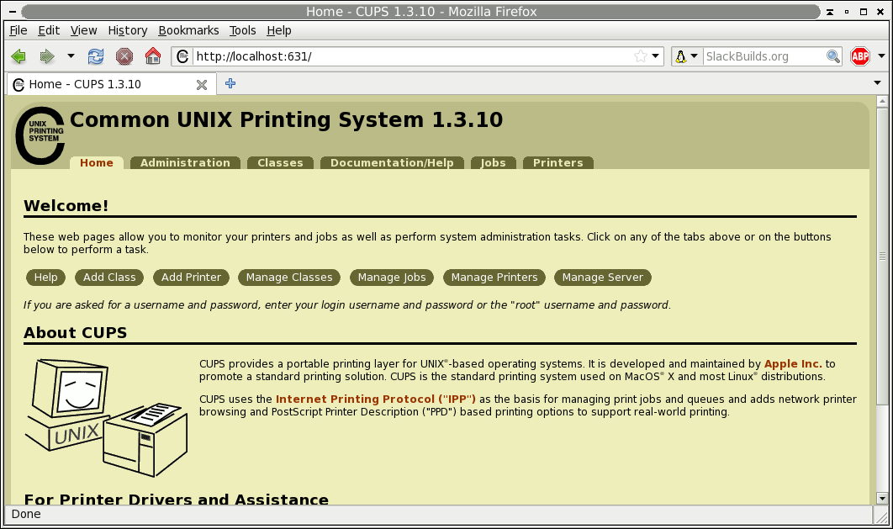

### 选择打印程序

Linux历史上和打印机有一段“恩怨”。在很多年内，打印对很多Linux用户来说是一种“黑魔法”，很少有打印机能在Linux上可靠地运作。不过在现在，绝大多数打印机都能在Linux上运行得很好，但还是有部分不能在Linux下很好的运行。如果你准备购买打印机，要注意，很多廉价的喷墨打印机在Linux支持上不如更昂贵的激光打印机。如果你不确定一台打印机是否能被很好的支持，你可以在网络上看看该型号是否有人在Linux下成功使用过。

所有这些警告，也许有些矫枉过正，大多打印机只需要简短的设置就能在Linux上工作。在这个方向上的进步主要归功于通用Unix打印系统——CUPS (Common Unix Printing System)。CUPS是被Slackware和其他大多数Linux发行版使用的打印系统。它主要是使用一个通过浏览器访问的图形界面设置程序来完成设置。为了使用CUPS设置一个打印机，你需要打开浏览器，如Firefox或Konqueror，并访问[http://localhost:631](htp://localhost:631)。

你也许会发现只需要一路下一步，CUPS就会几乎自动配置完成你的打印机。或者，你可能会发现需要进一步配置。要了解打印如何工作或如何配置一个棘手的打印机，请继续阅读。

